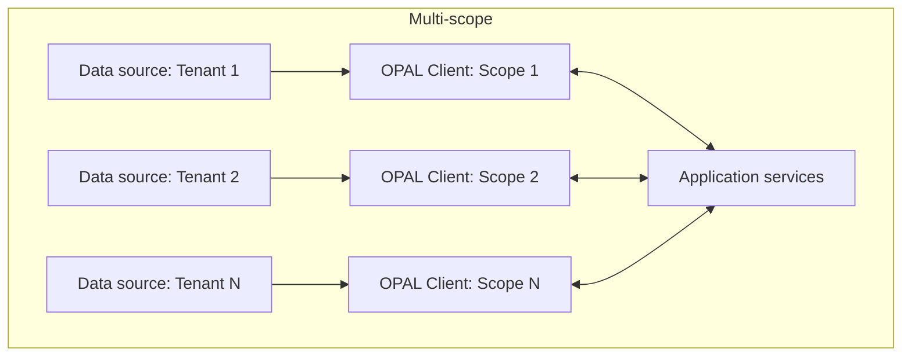
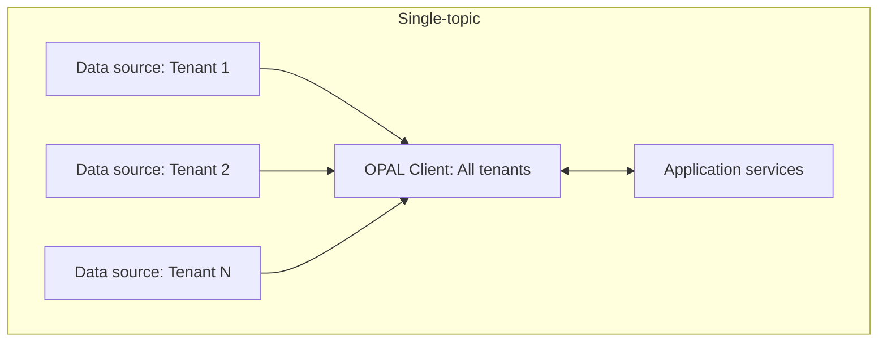
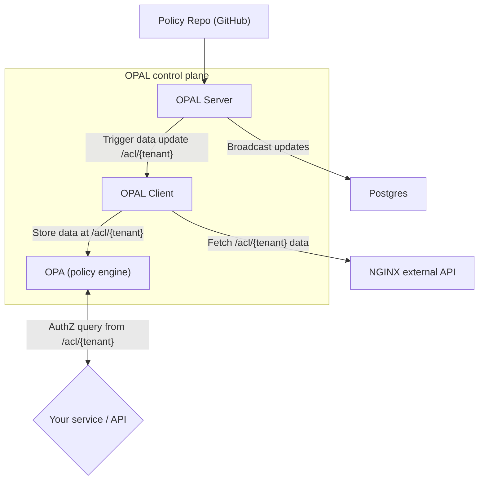

# Single-Topic Multi-Tenant Configuration

This guide explains how to set up OPAL for multi-tenant environments using a single-topic approach.
With this configuration, you can onboard new tenants seamlessly—without restarting OPAL services or managing stateful [OPAL Scopes](https://opal.ac/overview/scopes).

## Understanding Multi-Tenancy Topologies

### Multi-topic Architecture

In traditional OPAL setups, each tenant requires its own data topic:

```
Tenant 1: OPAL_DATA_TOPICS=tenant_1_data
Tenant 2: OPAL_DATA_TOPICS=tenant_1_data,tenant_2_data  # requires restart
Tenant 3: OPAL_DATA_TOPICS=tenant_1_data,tenant_2_data,tenant_3_data  # requires restart
```



#### Benefits
- **Per-tenant resource isolation** – each OPAL client (and its embedded OPA) only stores the data that belongs to its tenant, keeping memory/CPU usage proportional to tenant size.
- **Horizontal scalability for heavy tenants** – if one tenant's data set balloons, you can spin up a dedicated client/OPA pair for it without affecting everyone else.
- **Reduced blast-radius** – data or policy errors are contained to the tenant's own topic and client.

#### Challenges

- **Operational overhead** – deployment automation must track one topic per tenant and keep ACLs, scopes, and monitoring in sync.
- **Increased resource utilization** - each tenant requiring a dedicated OPAL Client instance/s.
- **Higher broker cost** – more topics/partitions increases metadata and connection overhead on Kafka/Redis/Postgres back-ends.
- **Cross-tenant queries require fan-out** – cross-tenant admin tasks need to fetch data from every topic.
- **On-boarding friction** – adding a tenant still demands a scope or a rolling configuration update.

The single-topic configuration described below addresses these issues by providing a simpler, more scalable approach.

### Single-topic Architecture

With single-topic configuration, all tenants share one topic:

```
All tenants: OPAL_DATA_TOPICS=tenant_data  # no restart needed when adding tenants
```

The key insight is using **multiple external data sources** under a single topic. Each tenant gets its own data source, but all publish to the same topic with different destination paths:
- **Tenant 1**: External data source A → `tenant_data` topic → `/acl/tenant1` path
- **Tenant 2**: External data source B → `tenant_data` topic → `/acl/tenant2` path
- **Tenant N**: External data source N → `tenant_data` topic → `/acl/tenantN` path

### Benefits

- **No service restarts required when adding new tenants** - does not require `OPAL_DATA_CONFIG_SOURCES` configuration changes, with a rolling restart.
- **Better resource utilization** - tenants are accessible from all OPAL Clients (i.e. OPA instances).
- **Simplified topic management** - no need to manage new topics or scopes being in sync with tenants.
- **Real-time data source notifications** - Changes to tenant data can be immediately propagated using triggered data updates, propagating to all OPAL Clients without requiring restarts.
- **Faster tenant onboarding** - New tenants can be added instantly without configuration changes or new deployments.

### Challenges

- **Higher memory footprint per client** - every OPAL Client must hold *all* tenants' data, which can reduce performance from OPA, or exceed it limits for larger tenants.
- **Increased Data Source load** - all OPAL Clients would need to fetch the tenants' data, even when it is used by only some of them.
- **Horizontal-scaling Data** - supporting tenants with larger datasets may exceed OPA's data capacity.
- **Horizontal-scaling Tenants** - supporting more tenants would require larger OPAL Client instances.



## Demo Setup with Docker Compose

Provided a docker compose to show an example setup of a single-topic multi-tenant architecture.

#### Prerequisites

- Docker and Docker Compose ([Install instructions](https://docs.docker.com/get-docker/))
- `jq` for JSON processing ([Install instructions](https://stedolan.github.io/jq/download/))

### Running the demo script

This demo script shows the entire setup of a single-topic multi-tenant architecture.

```bash
cd docker
./run-example-with-single-topic-multi-tenant.sh
```

This script will:
1. Start the OPAL Server, Client, and an external data provider.
2. Configure data sources for two tenants using the single topic approach.
3. Test authorization queries for both tenants.
4. Verify data isolation between tenants.

### How it works



#### 1. Data source entries

Each tenant's data is configured as a separate data source entry with:
- **url**: Endpoint serving tenant data
- **topics**: Always `["tenant_data"]` for all tenants
- **dst_path**: Unique path for tenant data isolation (e.g., `/acl/tenant1`)

#### 2. Topic publishing

When any tenant data is updated:
1. OPAL server publishes to the single `tenant_data` topic
2. All OPAL clients subscribed to `tenant_data` receive the notification
3. Clients fetch and update only the specific tenant data that changed

#### 3. Data isolation

Tenant isolation is achieved through OPA path hierarchy:
- Tenant 1 data: `/acl/tenant1`
- Tenant 2 data: `/acl/tenant2`
- Tenant N data: `/acl/tenantN`

### Manually running the demo

#### 1. Starting the services

```bash
docker compose -f docker/docker-compose-single-topic-multi-tenant.yml up -d
```

Verify services are running:
```bash
curl http://localhost:7002/healthcheck   # OPAL Server
curl http://localhost:8181/health        # OPA
curl http://localhost:8090/acl/tenant1   # External Data Provider
```

#### 2. Adding Tenants

Add first tenant:
```bash
curl -X POST http://localhost:7002/data/config \
  -H "Content-Type: application/json" \
  -d '{
    "entries": [{
      "url": "http://example_external_data_provider:80/acl/tenant1",
      "topics": ["tenant_data"],
      "dst_path": "/acl/tenant1"
    }],
    "reason": "Add tenant1 data source"
  }'
```

Add second tenant:
```bash
curl -X POST http://localhost:7002/data/config \
  -H "Content-Type: application/json" \
  -d '{
    "entries": [{
      "url": "http://example_external_data_provider:80/acl/tenant2",
      "topics": ["tenant_data"],
      "dst_path": "/acl/tenant2"
    }],
    "reason": "Add tenant2 data source"
  }'
```

Note: No service restart is required when adding new tenants.

#### 3. Check data isolation

```bash
# Tenant 1 data
curl -s http://localhost:8181/v1/data/acl/tenant1 | jq .

# Tenant 2 data
curl -s http://localhost:8181/v1/data/acl/tenant2 | jq .

# All tenant data
curl -s http://localhost:8181/v1/data/acl | jq .
```

#### 4. Monitor OPAL logs

**OPAL Server logs:**
```bash
docker compose -f docker/docker-compose-single-topic-multi-tenant.yml logs -f opal_server
```

You should see the following logs:
```
Publishing data update to topics: {'tenant_data'}, reason: Add tenant1 data source, entries: [{'url': 'http://example_external_data_provider:80/acl/tenant1', 'method': 'PUT', 'path': '/acl/tenant1', 'inline_data': False, 'topics': ['tenant_data']}]
185.199.109.133:55981 - "POST /data/config HTTP/1.1" 200
Broadcasting incoming event: {'topic': 'tenant_data', 'notifier_id': '7a4b55cd27d34df8a1e4ff5fc5c7516f'}
```

Then again for tenant 2:
```
Publishing data update to topics: {'tenant_data'}, reason: Add tenant2 data source, entries: [{'url': 'http://example_external_data_provider:80/acl/tenant2', 'method': 'PUT', 'path': '/acl/tenant2', 'inline_data': False, 'topics': ['tenant_data']}]
185.199.109.133:59019 - "POST /data/config HTTP/1.1" 200
Broadcasting incoming event: {'topic': 'tenant_data', 'notifier_id': '4dd064469d75485c9d3547c7dda55215'}
```

**OPAL Client logs:**
```bash
docker compose -f docker/docker-compose-single-topic-multi-tenant.yml logs -f opal_client
```

You should see the following logs:
```
Received notification of event: tenant_data
Updating policy data, reason: Add tenant1 data source
Triggering data update with id: 51fc5aa4905e4f62a88be058b6572991
Fetching data from url: http://example_external_data_provider:80/acl/tenant1
Saving fetched data to policy-store: source url='http://example_external_data_provider:80/acl/tenant1', destination path='/acl/tenant1'
Received request.    PUT /v1/data/acl/tenant1
Sent response.       PUT /v1/data/acl/tenant1 -> 204
```

Then again for tenant 2:
```
Received notification of event: tenant_data
Updating policy data, reason: Add tenant2 data source
Triggering data update with id: 1f355993f9334f35b781232c591e65e5
Fetching data from url: http://example_external_data_provider:80/acl/tenant2
Saving fetched data to policy-store: source url='http://example_external_data_provider:80/acl/tenant2', destination path='/acl/tenant2'
Received request.    PUT /v1/data/acl/tenant2
Sent response.       PUT /v1/data/acl/tenant2 -> 204
```

#### 5. Update existing tenant data

Update tenant 1 data:
```bash
curl -X POST http://localhost:7002/data/config \
  -H "Content-Type: application/json" \
  -d '{
    "entries": [{
      "url": "http://example_external_data_provider:80/acl/tenant1",
      "topics": ["tenant_data"],
      "dst_path": "/acl/tenant1"
    }],
    "reason": "Refresh tenant1 data"
  }'
```

#### 6. Test tenant-specific policies

```bash
curl -X POST http://localhost:8181/v1/data/policies/rbac/allow \
  -H "Content-Type: application/json" \
  -d '{
    "input": {
      "user": "alice",
      "action": "read",
      "resource": "document1",
      "tenant_id": "tenant1"
    }
  }' | jq .
```

## Production Considerations

### Use Policy Repo webhooks instead of polling

For production environments, configure webhooks for immediate policy updates:

```yaml
opal_server:
  environment:
    - OPAL_POLICY_REPO_WEBHOOK_SECRET=your-secure-secret
```

Read more about [Policy Repo webhooks](/tutorials/track_a_git_repo#option-2-using-a-webhook).

### Secure data sources

Configure authentication for external data APIs:

```bash
curl -X POST http://localhost:7002/data/config \
  -H "Content-Type: application/json" \
  -d '{
    "entries": [{
      "url": "https://secure-api.yourdomain.com/tenant-data/tenant1",
      "config": {
        "headers": {
          "Authorization": "Bearer your-secure-token"
        }
      },
      "topics": ["tenant_data"],
      "dst_path": "/acl/tenant1"
    }]
  }'
```

## Troubleshooting

### Tenant not receiving data

Check:
1. Topic configuration: `OPAL_DATA_TOPICS=tenant_data`
2. External data provider endpoint availability
3. OPAL Client logs for connection errors

```bash
# Test data endpoint
curl http://localhost:8090/acl/tenant1

# Check client logs
docker logs $(docker compose ps -q opal_client)
```

### Data isolation issues

Verify:
1. Unique `dst_path` for each tenant
2. Policies correctly handle `tenant_id` in input

```bash
# Check OPA data structure
curl -s http://localhost:8181/v1/data | jq .
```


## Related Documentation

- [Configure External Data Sources](/tutorials/configure_external_data_sources)
- [Trigger Data Updates](/tutorials/trigger_data_updates)
- [Track a Git Repository](/tutorials/track_a_git_repo)
